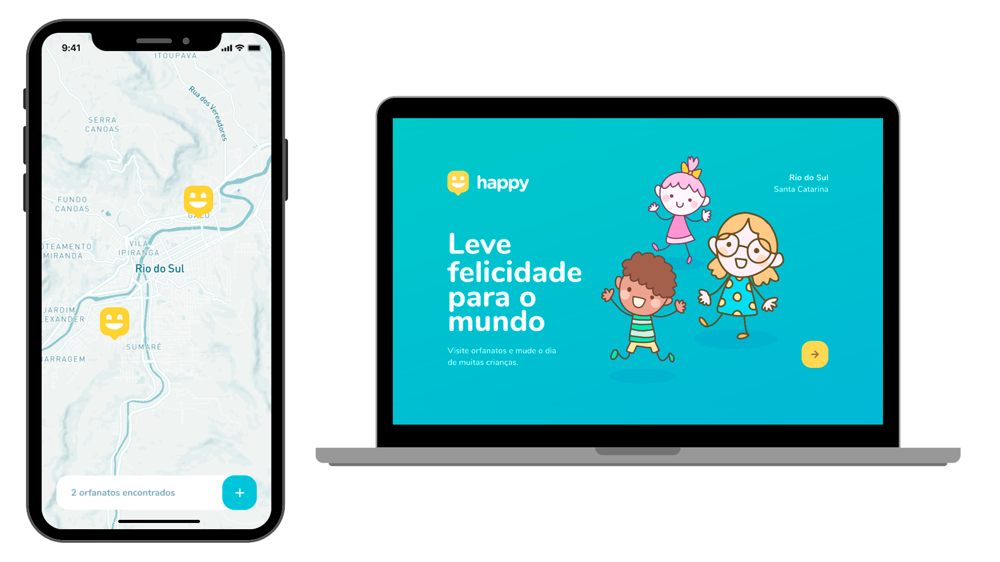

<h1 align="center">
  
</h1>

<h4 align="center">
  :clock130:  NextLevelWeek 3.0 🚀 Em andamento! :clock130:
</h4>

<p align="center">
  
  <a href="https://www.leovieira.dev">
    
  </a>
  <a href="https://github.com/leovieira/NLW-3.0/commits/main">
    
  </a>
  <a href="https://github.com/leovieira/NLW-3.0/blob/main/LICENSE">
    
  </a>
  <a href="https://github.com/leovieira/NLW-3.0/stargazers">
    
  </a>
</p>

<p align="center">
  <a href="#information_source-o-que-a-next-level-week-oferece">Next Level Week</a>&nbsp;&nbsp;&nbsp;|&nbsp;&nbsp;&nbsp;
  <a href="#-projeto">Projeto</a>&nbsp;&nbsp;&nbsp;|&nbsp;&nbsp;&nbsp;
  <a href="#rocket-tecnologias">Tecnologias</a>&nbsp;&nbsp;&nbsp;|&nbsp;&nbsp;&nbsp;
  <a href="#information_source-como-usar">Como usar</a>&nbsp;&nbsp;&nbsp;|&nbsp;&nbsp;&nbsp;
  <a href="#-como-contribuir">Como contribuir</a>&nbsp;&nbsp;&nbsp;|&nbsp;&nbsp;&nbsp;
  <a href="#memo-licença">Licença</a>
</p>

## :information_source: O que a Next Level Week oferece?

A NLW é uma semana prática com muito código, desafios e interações. Porém, possui um único objetivo: levar você ao próximo nível.
Através do nosso método, você aprenderá novas ferramentas, aprenderá sobre novas tecnologias e descobrirá hacks que irão impulsionar sua carreira.
Um evento online e totalmente gratuito que o ajudará a dar o próximo passo na sua evolução como desenvolvedor.

### Dias

- Dia 1: Acelerando sua evolução 12/10 - :heavy_check_mark:
- Dia 2: Olhando as oportunidades 13/10 - :heavy_check_mark:
- Dia 3: A escolha da stack 14/10 - :heavy_check_mark:
- Dia 4: Até 2 anos em 2 meses 15/10 - :heavy_check_mark:
- Dia 5: A milha extra 16/10 - :x:

## 💻 Projeto

Happy é um projeto desenvolvido pensando no dia das crianças. O objetivo é conectar pessoas a orfanatos próximos a suas residências.

<h1 align="center">
  
</h1>

## :rocket: Tecnologias

Este projeto foi desenvolvido com as seguintes tecnologias:

- [Node.js][nodejs]
- [TypeScript][typescript]
- [React][reactjs]
- [React Native][rn]
- [Expo][expo]

## :information_source: Como usar

Para clonar e executar este projeto, você precisará instalar o [Git](https://git-scm.com), [Node.js][nodejs] e [Yarn][yarn] no seu computador.

### Instalando a aplicação Back-end

```bash
# Clona este repositório
$ git clone https://github.com/leovieira/NLW-3.0

# Entra no diretório
$ cd NLW-3.0/backend

# Instala as dependências
$ yarn install

# Cria o banco de dados
$ yarn typeorm migration:run

# Inicia o servidor
$ yarn run dev

# A aplicação está sendo executada na porta 3333
```

### Instalando a aplicação Web

```bash
# Clona este repositório
$ git clone https://github.com/leovieira/NLW-3.0

# Entra no diretório
$ cd NLW-3.0/web

# Instala as dependências
$ yarn install

# Inicia o servidor
$ yarn run start

# A aplicação está sendo executada na porta 3000
```

### Instalando a aplicação Mobile

```bash
# Clona este repositório
$ git clone https://github.com/leovieira/NLW-3.0

# Entra no diretório
$ cd NLW-3.0/mobile

# Instala as dependências
$ yarn install

# Inicia o expo em modo debug
$ yarn run start

# A página de debug do expo será aberta no seu navegador, apenas leia o QR Code com o App do expo

# Se houver algum problema com as fontes, execute:
$ expo install expo-font @expo-google-fonts/nunito

```

## 🤔 Como contribuir

- Faça um fork desse repositório;
- Cria uma branch com a sua feature: `git checkout -b my-feature`;
- Faça commit das suas alterações: `git commit -m 'feat: My new feature'`;
- Faça push para a sua branch: `git push origin my-feature`.

Depois que o merge da sua pull request for feito, você pode deletar a sua branch.

## :memo: Licença

Esse projeto está sob a licença MIT. Veja o arquivo [LICENSE](https://github.com/leovieira/NLW-3.0/blob/main/LICENSE) para mais detalhes.

Este README foi baseado em: https://github.com/DanielObara/NLW-1.0

Feito com ❤️ por LéoVieira™ :wave: [Entre em contato!](https://www.leovieira.dev)

[nodejs]: https://nodejs.org/
[typescript]: https://www.typescriptlang.org/
[expo]: https://expo.io/
[reactjs]: https://reactjs.org
[rn]: https://facebook.github.io/react-native/
[yarn]: https://yarnpkg.com/
